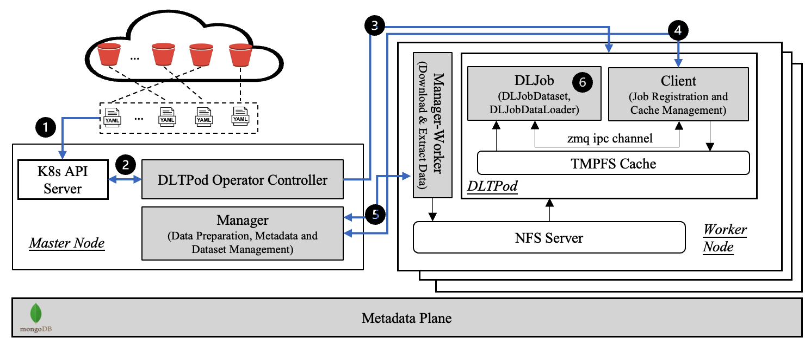

# DLCache
This repo is created for reproducibility and sharing the codes used for the paper, Dataset Placement and Data Loading Optimizations for Cloud-Native Deep Learning Workloads, accepted by The 26th International Symposium On Real-Time Distributed Computing (IEEE ISORC 2023).

cite the paper
```latex
@inproceedings{kang2023dlcache,
  title={Dataset Placement and Data Loading Optimizations for Cloud-Native Deep Learning Workloads},
  author={Kang, Zhuangwei and Min, Ziran and Zhou, Shuang and Barve D. Yogesh and Gokhale, Aniruddha},
  booktitle={2023 IEEE 26th International Symposium On Real-Time Distributed Computing (ISORC)},
  year={2023},
  organization={IEEE}
}
```

We introduce DLCache, a dataset management and runtime-aware data-loading solution that supports low-latency and high-throughput I/O requirements of DL training jobs in the setting where users utilize cloud buckets as persistent data storage and a dedicated computation cluster for training. DLCache is a cloud-native system that seamlessly integrates with the Kubernetes (K8s) ecosystem, allowing users and system maintainers to easily deploy, update, scale, and self-heal components. 



DLCache was evaluated on the Imagenet-ILSVRC and LibriSpeech datasets using a hybrid of 3 batch size configurations and 6 simulated computation time settings. Empirical results demonstrate that compared to the PyTorch framework, DLCache exhibits a substantial improvement in data loading throughput, reaching up to 147.49% and 49.62% improvement for Imagenet-ILSVRC when there are 4 and 8 data-loading workers, respectively, and the presence of data stall. For the LibriSpeech dataset, DLCache achieved up to 156.67% and 39.70% improvement respectively under similar conditions. Due to the minor overhead of DLCache, when there is no data stall, DLCache's performance was found to be lower than that of PyTorch, with a maximum deviation of 3.03% and 7.74% for Imagenet-ILSVRC, and 0.12% and 5.89% for LibriSpeech.

## Downloads
To run the DLCache system, you need to set up a K8s cluster and execute the following steps:
```shell
# step 1. install DLTPod CRD
cd src/dlcpod-operator
kubectl apply -f config/samples/
make deploy IMG=zhuangweikang/dlcpod-operator:latest

# step 2. set up NFS servers on worker nodes (please change the IPs in nfs.sh to yours)
cd cluster/nfs
./nfs.sh

# step 3. install MongoDB Statefulset
cd cluster/mongodb
./setup.sh

# step 4. install Manager (please change the IPs and mount paths in manager.yaml to yours)
cd cluster/manager
kubectl apply -f .

# step 5. install Manager-Worker Daemonset
cd cluster/manager-worker
kubectl apply -f daemonset.yaml
```

## Deploy DLTPod
To deploy a DLTPod in the DLCache system, you should have an image for your DL application, then write a YAML file to define the DLTPod. A DLTPod example for an image classification application can be find [here](./experiments/exp1/imagenet/DLCache/ilsvrc.yaml).
